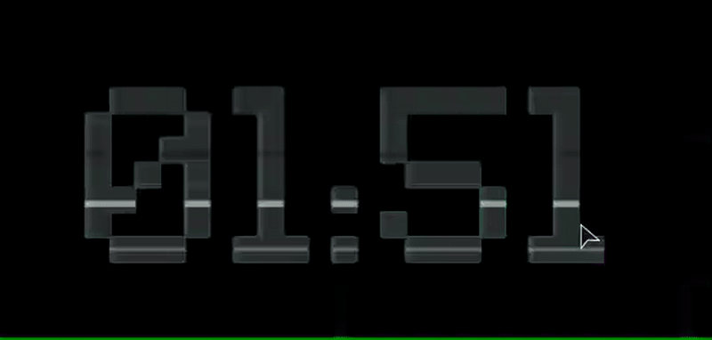
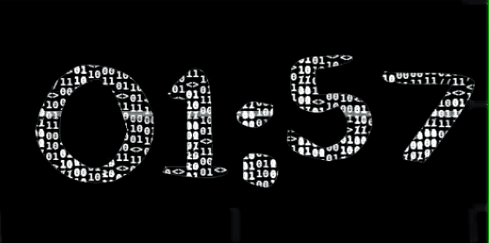

# LarpClock

A highly customizable **KDE Plasma 6 digital clock widget** focused on animated cyberpunk-style visual effects.

LarpClock keeps the interface minimal — just the time — while putting the focus on animated effects like Matrix rain, chromatic glitches, scanlines, RGB ghosting, and distortion bursts.

<p align="center">
  
</p>

<p align="center">
  
</p>

## Features

* Minimal `HH:MM` clock design
* Transparent widget background
* KDE Plasma 6 native plasmoid
* 12-hour and 24-hour formats
* Custom installed font selector
* Adjustable font size
* Adjustable font weight
* Adjustable letter spacing
* Custom clock colors
* Custom effect colors
* Scrollable configuration pages
* Preset effect profiles
* Fully customizable effect timings

## Effect Presets

Several presets are included:

* Clean
* Matrix
* Comic Glitch
* Cyberpunk
* Neon Pulse
* Data Corruption
* Chaos
* Custom

Presets provide a quick starting point while individual settings can still be adjusted afterward.

## Requirements

* KDE Plasma 6
* Qt 6
* Linux distribution with Plasma 6 support

Tested primarily on:

```text
Parrot OS / Debian-based Linux
KDE Plasma 6
```

## Installation

Clone the repository:

```bash
git clone https://github.com/larper069/LarpClock.git
cd LarpClock
```

Install the plasmoid:

```bash
kpackagetool6 --type Plasma/Applet --install package
```

If LarpClock is already installed:

```bash
kpackagetool6 --type Plasma/Applet --upgrade package
```

Restart Plasma if required:

```bash
systemctl --user restart plasma-plasmashell.service
```

Alternatively:

```bash
kquitapp6 plasmashell && kstart6 plasmashell
```

Then:

1. Right-click your KDE desktop.
2. Select **Add Widgets**.
3. Search for **LarpClock**.
4. Drag it onto your desktop.

## 


### Effects

You can control:

* Matrix Rain
* Chromatic Glitch
* Horizontal Glitch
* Distortion Bursts
* CRT Scanlines
* RGB Ghost Trail
* Neon Pulse

Most effects expose their own speed, duration, interval, intensity, opacity, or color controls.

## Project Structure

```text
LarpClock/
├── package/
│   ├── metadata.json
│   └── contents/
│       ├── config/
│       └── ui/
├── screenshots/
│   ├── demo.gif
│   └── demo1.gif
├── README.md
└── LICENSE
```

## Development

The widget is primarily built using:

* QML
* Qt Quick
* KDE Plasma APIs
* Qt Quick Effects

No Electron or browser engine is required.

For development, install the widget after making changes:

```bash
kpackagetool6 --type Plasma/Applet --upgrade package
```

Then restart Plasma:

```bash
systemctl --user restart plasma-plasmashell.service
```


